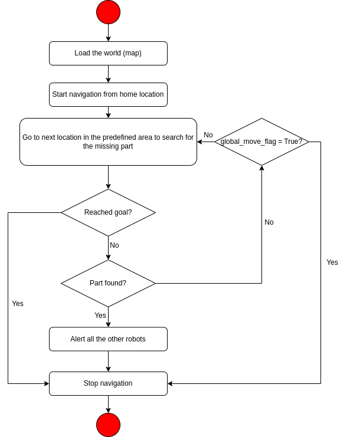

# Finder-Bots-Swarm-Intelligence

[](https://github.com/Datta-Lohith/Finder-Bots-Swarm-Intelligence/actions/workflows/build.yaml)
[](https://codecov.io/gh/Datta-Lohith/Finder-Bots-Swarm-Intelligence)
[](https://opensource.org/licenses/MIT)

## Overview

In the rapidly evolving domain of warehouse management, enhancing operations for quicker and more precise item retrieval is crucial. Collaborating with Acme Robotics, this project aims to develop an autonomous multi-robot swarm system named FinderBots, leveraging the Robot Operating System (ROS). This system will deploy a swarm of over 20 TurtleBots to autonomously locate misplaced items within the warehouse environment. Initial validation of functionality will be performed through simulations in Gazebo and RViz before transitioning to real-world deployment.

### Problem Statement

Acme Robotics encounters difficulties in efficiently locating valuable items that are frequently misplaced in their warehouses. Traditional manual search methods are labor-intensive, susceptible to human error, and disrupt workflow efficiency. FinderBots seeks to resolve these challenges by creating an advanced swarm system based on ROS. Using Aruco markers and computer vision, the TurtleBots will systematically scan designated warehouse areas. Upon finding a missing item, the bots will communicate the location to the operator and then return to their starting positions.

Simulations in Gazebo and RViz will verify the swarm’s robustness, ensuring operational efficiency in the warehouse environment. Implementing this system will enable Acme Robotics to achieve higher efficiency, lower item retrieval costs, and revolutionize warehouse management practices.

## Method

To create a collaborative, obstacle-free environment for a swarm of robots:

1. Deploy all TurtleBots at various initial positions within the warehouse. Each TurtleBot then initiates a search operation within a specified radius to locate the lost item.
2. Each TurtleBot scans for the Aruco marker on the lost item, which is unique to each warehouse good, or uses its camera with OpenCV to identify the item.
3. As the TurtleBots explore, they utilize SLAM for localization and to avoid dynamic obstacles, such as other TurtleBots. SLAM can also be used to generate both local and global maps of the environment for better optimization, which is an ambitious goal for the project.
4. When a TurtleBot finds the lost item, it reports the coordinates to the operator and the other TurtleBots. All TurtleBots then return to their original stations.

## Potential Risks
- **Dynamic Obstacle Avoidance**: In a multi-robot environment, each robot must generate a path or search strategy that avoids dynamic obstacles, such as humans or other robots. To address this risk, we plan to study various planning algorithms available in the navigation package and select the most efficient one. Additionally, we aim to enhance the robots' localization through effective SLAM (Simultaneous Localization and Mapping) implementation.

## Activity Diagram

<p align="center">

</p>

## Team

[](https://github.com/datta-lohith)
[](https://github.com/VVSDheeraj)
[](https://github.com/nazringr)

## Phase 0:
In phase 0 we have started with high level design which is the UML and made activity diagram with classes which will be helpful in understanding the project process flow. 

### Deliverables
[](Proposal%20Documents/Final%20Project%20Proposal.pdf)


## Phase 1:
In phase 1 we have started the implementation of high level design which is in the UML. Detailed explanation of phase 1 can be seen in the explanation video

### Deliverables
[](https://drive.google.com/drive/folders/1AezMEajkKVZfWjoIooM5w4Lc3BmzG9cc?usp=sharing)
[](Proposal%20Documents/Quad-chart.png)
[](UML/Initial/UML_initial.pdf)
[](https://docs.google.com/spreadsheets/d/1mzUmKYqlQhvRb29pOtZRma7boKkiH_8TuComcVauGqs/edit?gid=1401548367#gid=1401548367)
[](https://docs.google.com/document/d/1_KAaVskDQHgv2-JqpK4O14OvZsn7DmvWvP07JKbWXO4/edit?tab=t.0#heading=h.qjzjmvycu701)


## Phase 2:
In phase 2 we have completed the implementation of high level design which is in the UML. Added New test cases which test the functionality of the classes implemented, also using rosbag. Detailed explanation of phase 2 can be seen in the explanation video

### Deliverables
[](https://drive.google.com/drive/folders/1vHlmZVLcN4SkadmPLdZ9S3DudFsQrEha?usp=sharing)
[](https://drive.google.com/drive/folders/1vHlmZVLcN4SkadmPLdZ9S3DudFsQrEha?usp=sharing)
[](UML/Revised/UML_Revised.pdf)
[](https://docs.google.com/spreadsheets/d/1mzUmKYqlQhvRb29pOtZRma7boKkiH_8TuComcVauGqs/edit?gid=1401548367#gid=1401548367)
[](https://docs.google.com/document/d/1_KAaVskDQHgv2-JqpK4O14OvZsn7DmvWvP07JKbWXO4/edit?tab=t.0#heading=h.qjzjmvycu701)

## Dependencies Installation
The project requires opencv library installation. Follow the below procedure to install opencv libraries

```bash
    # Clone the Repository
    git clone https://github.com/Datta-Lohith/Finder-Bots-Swarm-Intelligence.git
    # Go to the directory where the folder is downloaded
    cd Finder-Bots-Swarm-Intelligence
    # Install Dependencies
    ./scripts/install_dependencies.sh
```

## Code Build Procedure
Follow the below procedure to build the code after installing the dependencies

```bash
colcon build --cmake-args -DCOVERAGE=1 --packages-select finder_bots
```
To run the project:
- Terminal 1

  ```bash
  ros2 launch finder_bots warehouse.launch.py
  ```

- Terminal 2(Run this command after all the robots are spawned)

  ```bash
  ros2 run finder_bots finderBots
  ```
  or

  ```bash
  ros2 launch finder_bots finderBots.launch.py
  ```


To run the tests:
```bash
colcon test --event-handlers console_direct+
```

To run the tests and generate code coverage reports:

```bash
./do-tests-and-coverage.bash
```

To generate docs:

```bash
./do-docs.bash
```


## Static Code Analysis with `clang-tidy` and `cpplint`

We use static analysis tools to ensure code quality and consistency.These commands are used for static code analysis.

### `clang-tidy` Command

Run `clang-tidy` with the following command to check for potential issues in the code:

```bash
clang-tidy src/*.cpp test/*.cpp> results/clang-tidy.txt
```
**or**
```bash
clang-tidy --extra-arg=-stdlib=libc++ --extra-arg=-I/usr/include/c++/11 --extra-arg=-I/usr/include/x86_64-linux-gnu/c++/11 src/*.cpp test/*.cpp> results/clang-tidy.txt
```

- **`-p ./`**: Specifies the location of the `compile_commands.json` file.
- **`--extra-arg=-stdlib=libc++`**: Specifies the standard library to be used for analysis (in this case, `libc++`).
- **`--extra-arg=-I/usr/include/c++/11` and `--extra-arg=-I/usr/include/x86_64-linux-gnu/c++/11`**: Adds the necessary include paths for the C++ standard library and architecture-specific directories.
- **`src/*.cpp`**: Finds all `.cpp` files in the src folder.
- **`test/*.cpp`**: Finds all `.cpp` files in the test folder.

### `cpplint` Command

Run `cpplint` to check the style of the C++ code using this command:

```bash
cpplint --filter=-build/c++11,+build/c++17,-build/namespaces,-build/include_order src/*.cpp test/*.cpp >  results/cpplint.txt;
```

- **`cpplint`**: This is the command-line tool for checking C++ code style against Google’s C++ style guide. It flags potential style violations to help maintain consistent code style.

- **`--filter=<rules>`**: The `--filter` flag allows you to include or exclude specific linting rules. Each rule is prefixed with `+` (to include) or `-` (to exclude).

  - **`-build/c++11`**: Excludes rules that enforce C++11 standard practices, allowing more modern C++ standards to be used without warnings.

  - **`+build/c++17`**: Includes rules specific to the C++17 standard, so code is checked against C++17 best practices.

  - **`-build/namespaces`**: Disables checks for namespace style issues, which might be useful if your project has specific namespace conventions.

  - **`-build/include_order`**: Disables checks for include order rules, which can be helpful if your project has a custom include ordering.

- **`src/*.cpp`**: Specifies all `.cpp` files in the `src` directory as the input files for linting.

- **`test/*.cpp`**: Specifies all `.cpp` files in the `test` directory as the input files for linting.

- **`> results/cpplint.txt`**: Redirects the output of the linting results to a file called `cpplint.txt` in the `results` directory. This allows you to review linting feedback later without cluttering the terminal output.

This command runs `cpplint` on all `.cpp` files in the `src` and `test` directory, applies specific filters to customize the linting rules, and saves the output to `results/cpplint.txt`.

## Simulation Video


## LICENSE

This project is open source and is released under the Apache License 2.0. You are free to use, modify, and distribute the code in accordance with the terms of the Apache License 2.0.
